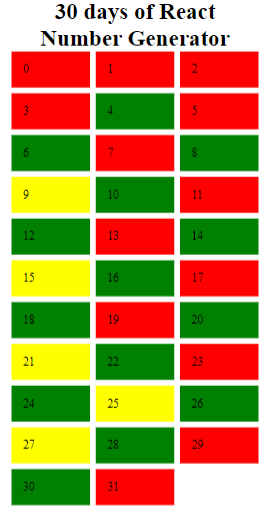
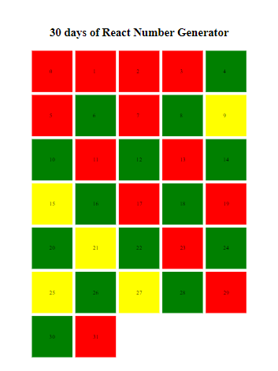
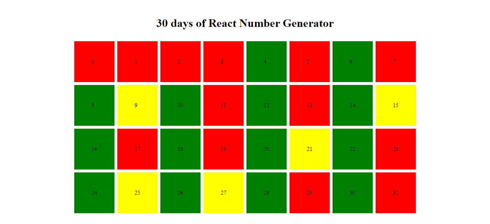

# 30 days of React

## Table of contents

- [Overview](#overview)
  - [The challenge](#the-challenge)
  - [Screenshot](#screenshot)
  - [Links](#links)
- [My process](#my-process)
  - [Built with](#built-with)
- [Author](#author)

## Overview

### The challenge

Create a  profile card using  React functional component
### Screenshot

### Links

- Solution URL: (https://github.com/ibimina/my-four)
- Live Site URL:(https://ibimina.github.io/my-four/)

## My process
- import react from React
- import reactdom from react-dom/client
- import css and the image to be used for the project
- created variable to store some value
- created functional component for the header, main and footer
- created an App component to differentiate between even odd and prime

- renedered the app component in the DOM

### Built with

- JSX
- CSS custom properties
- Flexbox
- gridm
- Mobile-first workflow

## Author

- Ibimina Hart
- Twitter -(https://www.twitter.com/ibiminaaH)
